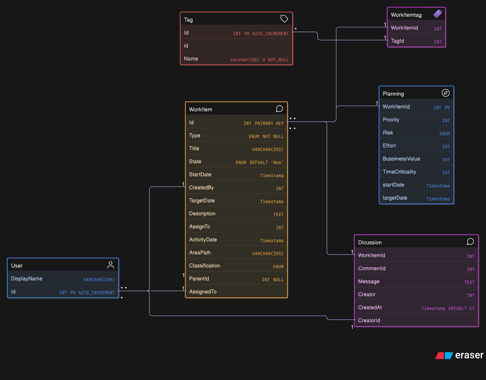

## Epic feature (Azure devops) - CRUD App

*Database schema*

*ORM's choices*
### TypeORM
- Official NestJS integration (`@nestjs/typeorm`)
- Verbose syntax with decorators
- Known for bugs and inconsistent behavior in community discussions
- Currently lacking active maintainers; in maintenance mode

### Prisma
- Strongly typed with excellent developer experience
- Actively maintained with comprehensive documentation
- Integrates well with NestJS using custom providers
- Some performance overhead in complex queries

### Drizzle ORM
- TypeScript-first, very fast, no code generation required
- Fully type-safe and minimalistic
- No official NestJS integration; requires manual setup
- Still new with a smaller ecosystem

### MikroORM
- Fully typed and performs well
- Clean NestJS integration via `@mikro-orm/nestjs`
- Actively maintained and gaining popularity
- Less widely adopted but highly recommended by the community

Changes in project:

Variable - camel case
Class name - pascal case
Postgres - snake case
Entity - singular
table name - plural

Enum - best practices (naming)

Error handling - dto, controller

API documentations:
Swagger

